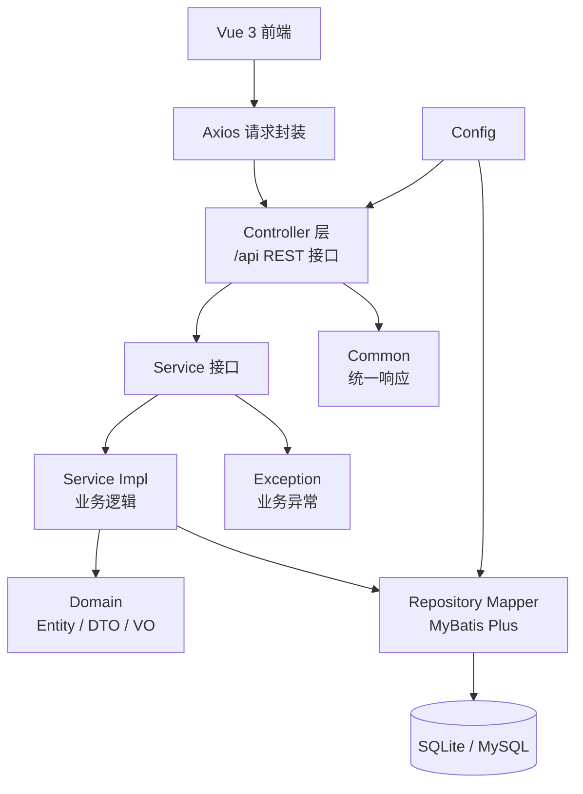

# 电商购物平台技术设计文档

**关联需求**：[电商购物平台需求](../01-product-specs/online-shop-platform-spec.md)  
**文档状态**：已确认  
**创建时间**：2026-06-09  
**最后更新**：2026-06-10  
**负责人**：@dev

---

## 概述

项目采用前后端分离架构。后端子项目 `online-shop-backend` 使用 Spring Boot 3.2.x、MyBatis Plus、Jakarta Validation、Druid、Shiro Jakarta 版和 SQLite/MySQL 数据源配置提供 RESTful API；前端子项目 `online-shop-frontend` 使用 Vue 3、Vite、Axios、Element Plus 和 Vue Router 实现购物流程页面。

为匹配 Harness 四层架构，后端使用 `controller`、`service`、`domain`、`repository`、`config`、`exception`、`common` 包；MyBatis Plus Mapper 接口放在 `repository.mapper` 子包，实体、DTO、VO 分别放在 `domain.entity`、`domain.dto`、`domain.vo` 子包。

---

## 架构设计

### 组件关系图



### 数据流向

**商品查询流程**：
1. 前端通过统一请求工具调用 `/api/products` 或 `/api/products/{id}`。
2. ProductController 校验查询参数并调用 ProductService。
3. ProductService 根据 `page`、`pageSize` 计算分页偏移量，通过 ProductMapper 查询商品和总数，转换为 ProductVO。
4. Controller 返回 `ApiResponse<ProductVO>` 或 `ApiResponse<PageVO<ProductVO>>`。

**购物车流程**：
1. 前端调用 `/api/cart/items` 添加商品或修改数量。
2. CartController 接收请求 DTO，调用 CartService。
3. CartService 校验商品存在、购买数量和库存，写入 cart_item。
4. CartService 根据商品价格计算购物车总价，返回 CartVO。

**下单流程**：
1. 前端调用 `/api/orders` 提交订单。
2. OrderService 查询当前用户购物车，校验库存。
3. OrderService 生成订单编号，按数据库价格计算总金额。
4. OrderService 在事务中保存 orders、order_item，扣减库存，删除购物车明细。
5. 如果库存不足或购物车为空，抛出业务异常并回滚事务。

**异常处理流程**：
1. Service 抛出 BusinessException 或 Validation 异常。
2. GlobalExceptionHandler 捕获异常。
3. 返回统一 JSON：`{ "code": 业务码, "message": 提示, "data": null }`。

---

## 接口定义

**基础路径**：`/api`

| 方法 | 路径 | 描述 | 认证 | 请求体 | 响应体 |
|------|------|------|------|--------|--------|
| GET | `/api/products` | 商品分页列表和搜索 | 预留 | — | `PageVO<ProductVO>` |
| GET | `/api/products/{id}` | 商品详情 | 预留 | — | `ProductVO` |
| GET | `/api/cart` | 查询购物车 | 预留 | — | `CartVO` |
| POST | `/api/cart/items` | 加入购物车 | 预留 | `AddCartItemRequest` | `CartVO` |
| PUT | `/api/cart/items/{id}` | 修改购物车数量 | 预留 | `UpdateCartItemRequest` | `CartVO` |
| DELETE | `/api/cart/items/{id}` | 删除购物车明细 | 预留 | — | `CartVO` |
| POST | `/api/orders` | 提交订单 | 预留 | `CreateOrderRequest` | `OrderVO` |
| GET | `/api/orders` | 订单列表 | 预留 | — | `List<OrderSummaryVO>` |
| GET | `/api/orders/{id}` | 订单详情 | 预留 | — | `OrderVO` |
| PUT | `/api/orders/{id}` | 更新订单收货信息 | 预留 | `UpdateOrderRequest` | `OrderVO` |
| PUT | `/api/orders/{id}/cancel` | 取消订单 | 预留 | — | `OrderVO` |
| DELETE | `/api/orders/{id}` | 删除已取消订单 | 预留 | — | `Void` |

### 统一响应

```json
{
  "code": 200,
  "message": "success",
  "data": {}
}
```

### 商品搜索参数

| 参数名 | 位置 | 类型 | 必填 | 描述 |
|--------|------|------|------|------|
| name | query | String | 否 | 商品名称模糊搜索 |
| category | query | String | 否 | 商品分类 |
| minPrice | query | BigDecimal | 否 | 最低价格 |
| maxPrice | query | BigDecimal | 否 | 最高价格 |
| page | query | Integer | 否 | 页码，默认 1 |
| pageSize | query | Integer | 否 | 每页数量，默认 6，最大 50 |

### 商品分页响应

| 字段名 | Java 类型 | 说明 |
|--------|-----------|------|
| items | `List<ProductVO>` | 当前页商品列表 |
| total | long | 符合筛选条件的商品总数 |
| page | int | 当前页码 |
| pageSize | int | 每页数量 |
| totalPages | int | 总页数 |

### 请求 DTO

**AddCartItemRequest**

| 字段名 | Java 类型 | 校验规则 | 说明 |
|--------|-----------|----------|------|
| productId | Long | `@NotNull @Positive` | 商品 ID |
| quantity | Integer | `@NotNull @Min(1)` | 购买数量 |

**UpdateCartItemRequest**

| 字段名 | Java 类型 | 校验规则 | 说明 |
|--------|-----------|----------|------|
| quantity | Integer | `@NotNull @Min(1)` | 购买数量 |

**CreateOrderRequest**

| 字段名 | Java 类型 | 校验规则 | 说明 |
|--------|-----------|----------|------|
| receiverName | String | `@NotBlank @Size(max=50)` | 收货人 |
| receiverPhone | String | `@NotBlank @Size(max=30)` | 联系方式 |
| receiverAddress | String | `@NotBlank @Size(max=200)` | 收货地址 |

**UpdateOrderRequest**

| 字段名 | Java 类型 | 校验规则 | 说明 |
|--------|-----------|----------|------|
| receiverName | String | `@NotBlank @Size(max=50)` | 收货人 |
| receiverPhone | String | `@NotBlank @Size(max=30)` | 联系方式 |
| receiverAddress | String | `@NotBlank @Size(max=200)` | 收货地址 |

---

## 数据模型

### 实体类

**User 对应表：user**

| 字段名 | Java 类型 | 数据库类型 | 约束 | 说明 |
|--------|-----------|-----------|------|------|
| id | Long | BIGINT / INTEGER | PK | 用户 ID |
| username | String | VARCHAR(50) | NOT NULL | 账号 |
| password | String | VARCHAR(100) | NOT NULL | 密码 |
| nickname | String | VARCHAR(50) | NOT NULL | 昵称 |
| phone | String | VARCHAR(30) | NULL | 联系方式 |
| createdAt | LocalDateTime | DATETIME | NOT NULL | 创建时间 |

**Product 对应表：product**

| 字段名 | Java 类型 | 数据库类型 | 约束 | 说明 |
|--------|-----------|-----------|------|------|
| id | Long | BIGINT / INTEGER | PK | 商品 ID |
| name | String | VARCHAR(100) | NOT NULL | 商品名 |
| category | String | VARCHAR(50) | NOT NULL | 分类 |
| price | BigDecimal | DECIMAL(10,2) | NOT NULL | 价格 |
| stock | Integer | INTEGER | NOT NULL | 库存 |
| imageUrl | String | VARCHAR(255) | NULL | 图片 |
| description | String | TEXT | NULL | 描述 |
| createdAt | LocalDateTime | DATETIME | NOT NULL | 创建时间 |

**CartItem 对应表：cart_item**

| 字段名 | Java 类型 | 数据库类型 | 约束 | 说明 |
|--------|-----------|-----------|------|------|
| id | Long | BIGINT / INTEGER | PK | 明细 ID |
| userId | Long | BIGINT | NOT NULL | 用户 ID |
| productId | Long | BIGINT | NOT NULL | 商品 ID |
| quantity | Integer | INTEGER | NOT NULL | 数量 |
| createdAt | LocalDateTime | DATETIME | NOT NULL | 创建时间 |
| updatedAt | LocalDateTime | DATETIME | NOT NULL | 更新时间 |

**Order 对应表：orders**

| 字段名 | Java 类型 | 数据库类型 | 约束 | 说明 |
|--------|-----------|-----------|------|------|
| id | Long | BIGINT / INTEGER | PK | 订单 ID |
| orderNo | String | VARCHAR(32) | UNIQUE | 订单编号 |
| userId | Long | BIGINT | NOT NULL | 用户 ID |
| totalAmount | BigDecimal | DECIMAL(10,2) | NOT NULL | 总金额 |
| status | String | VARCHAR(20) | NOT NULL | 状态 |
| receiverName | String | VARCHAR(50) | NOT NULL | 收货人 |
| receiverPhone | String | VARCHAR(30) | NOT NULL | 联系方式 |
| receiverAddress | String | VARCHAR(200) | NOT NULL | 地址 |
| createdAt | LocalDateTime | DATETIME | NOT NULL | 创建时间 |

**OrderItem 对应表：order_item**

| 字段名 | Java 类型 | 数据库类型 | 约束 | 说明 |
|--------|-----------|-----------|------|------|
| id | Long | BIGINT / INTEGER | PK | 明细 ID |
| orderId | Long | BIGINT | NOT NULL | 订单 ID |
| productId | Long | BIGINT | NOT NULL | 商品 ID |
| productName | String | VARCHAR(100) | NOT NULL | 成交商品名 |
| productImageUrl | String | VARCHAR(255) | NULL | 成交商品图片 |
| price | BigDecimal | DECIMAL(10,2) | NOT NULL | 成交单价 |
| quantity | Integer | INTEGER | NOT NULL | 数量 |
| subtotal | BigDecimal | DECIMAL(10,2) | NOT NULL | 小计 |

### 状态枚举

| 枚举 | 值 | 说明 |
|------|----|------|
| OrderStatus | CREATED | 已创建 |
| OrderStatus | CANCELLED | 已取消 |

---

## 技术选型

| 技术 | 版本 | 用途 | 选择理由 |
|------|------|------|----------|
| Java | 17 | 后端运行时 | Spring Boot 3 基线版本 |
| Spring Boot | 3.2.x | 应用框架 | 满足 Spring Boot 3 要求 |
| Spring Framework | 6.x | Web MVC | Spring Boot 3 配套版本 |
| MyBatis Plus | 3.5.x | 数据访问 | 提供 BaseMapper CRUD 能力并保留自定义 SQL |
| Jakarta Validation | 3.x | 参数校验 | Spring Boot 3 使用 Jakarta 命名空间 |
| Druid | 1.2.x | 数据源 | 匹配实验要求 |
| Apache Shiro | 2.x Jakarta | 安全框架 | 预留登录校验扩展点并兼容 Jakarta Servlet |
| SQLite JDBC | 3.x | 初始数据库 | 本地零配置运行 |
| MySQL Connector/J | 8.x | 可选数据库 | 支持 profile 切换 |
| Vue 3 | 3.x | 前端框架 | 组件化页面 |
| Vite | 5.x | 前端构建 | 开发体验好 |
| Axios | 1.x | HTTP 请求 | 统一接口调用 |
| Element Plus | 2.x | UI 组件 | 快速构建实验页面 |

---

## 风险与注意事项

| 风险 | 影响程度 | 概率 | 应对策略 |
|------|----------|------|----------|
| Spring Boot 3 与 Jakarta 依赖兼容问题 | 中 | 中 | 使用 Jakarta Validation、Jakarta Servlet 和 Shiro Jakarta classifier |
| SQLite 与 MySQL SQL 方言差异 | 中 | 中 | 使用简单通用 SQL，schema 分 profile 管理 |
| Harness 原始模板偏向 JPA 包名 | 中 | 高 | MyBatis Plus Mapper 放入 repository 层并同步文档说明 |
| 全量覆盖率 80% 对完整项目成本较高 | 中 | 中 | 优先覆盖核心 Service 和 Controller，后续补充 Repository 测试 |

### 注意事项

1. Controller 不直接访问 Mapper，只调用 Service。
2. Service 负责库存校验、金额计算、订单编号生成和事务边界。
3. 取消订单仅允许 `CREATED` 状态，取消时回补库存。
4. 初版通过拦截器固定 `userId=1` 的实验用户上下文，保留 Shiro 配置和登录校验扩展点。

---

## 测试策略

| 测试类型 | 测试类 | 测试框架 | 覆盖场景 |
|----------|--------|----------|----------|
| Service 单元测试 | `ProductServiceImplTest` | Mockito | 商品搜索、商品不存在 |
| Service 单元测试 | `CartServiceImplTest` | Mockito | 加购、改数量、库存不足 |
| Service 单元测试 | `OrderServiceImplTest` | Mockito | 下单成功、库存不足、取消订单 |
| Controller 切片测试 | `ProductControllerTest` | @WebMvcTest | 列表、详情响应 |
| Controller 切片测试 | `CartControllerTest` | @WebMvcTest | 加购参数校验、查询购物车 |
| Controller 切片测试 | `OrderControllerTest` | @WebMvcTest | 下单、订单查询、取消 |
| Repository 切片测试 | `ProductMapperTest` | @MybatisTest | 分类筛选和分页 SQL |

---

## 变更记录

| 版本 | 日期 | 变更内容 | 变更人 |
|------|------|----------|--------|
| v1.1 | 2026-06-10 | 补充商品分页查询接口、分页响应结构和 Mapper slice 测试策略 | @dev |
| v1.0 | 2026-06-09 | 根据需求文档创建初始技术设计 | @dev |
