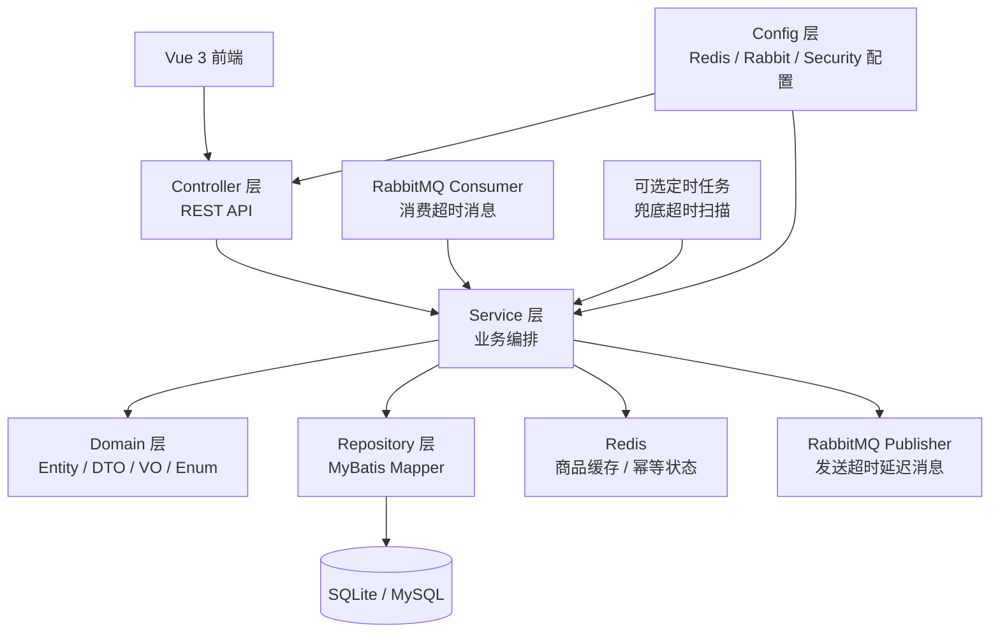

# 电商购物平台深挖增强技术设计文档

**关联需求**：[电商购物平台深挖增强需求](../01-product-specs/online-shop-platform-enhancement-spec.md)  
**文档状态**：已确认  
**创建时间**：2026-06-15  
**最后更新**：2026-06-15  
**负责人**：@dev  
**确认依据**：开发者已确认采用 Redis+Lua 订单幂等；超时订单采用 RabbitMQ TTL/DLX 延迟队列作为正式方案，定时任务仅保留为可关闭兜底。

---

## 概述

本设计在现有 Spring Boot 3、MyBatis Plus、SQLite/MySQL、Vue 3 项目基础上增量增强，不改变 Controller → Service → Domain ← Repository 的分层方向。Redis 用于商品缓存和订单幂等状态，RabbitMQ TTL/DLX 延迟队列用于订单超时消息投递，数据库仍作为订单、库存、用户和刷新令牌的最终持久化来源。定时任务只作为可关闭兜底执行器。

---

## 架构设计

### 组件关系图

### 数据流向

**商品缓存流程**：
1. ProductController 调用 ProductService，不直接访问缓存或 Mapper。
2. ProductService 查询详情或列表时先读取 Redis。
3. 缓存命中则返回 VO 并记录命中指标。
4. 缓存未命中则访问 ProductMapper，回写 Redis，按详情、列表、空值使用不同 TTL。
5. 商品新增、更新、删除成功后删除详情缓存，并清理列表缓存命名空间。

**Redis+Lua 下单幂等流程**：
1. OrderController 从 `Idempotency-Key` 请求头读取幂等键，并传给 OrderService。
2. OrderService 根据用户 ID、幂等键、请求体摘要生成 Redis key。
3. Lua 脚本原子判断幂等状态：不存在则写入 `PROCESSING`；成功结果已存在则返回 `SUCCESS`；请求摘要不一致返回冲突。
4. 首次请求在数据库事务内创建订单、扣减库存、清空购物车。
5. 事务成功后写入 Redis `SUCCESS` 结果；事务失败写入 `FAILED` 或删除处理中状态，避免永久占用。
6. 数据库订单唯一约束只作为最终兜底，不作为主幂等方案。

**RabbitMQ 超时订单流程**：
1. 创建订单成功后写入 `expireAt`，表示支付截止时间。
2. 事务提交后，OrderService 通过 `OrderTimeoutMessagePublisher` 发送一条按 `expireAt` 延迟的 RabbitMQ 消息。
3. RabbitMQ 使用 TTL 队列 + 死信交换机将到期消息投递到超时处理队列。
4. `OrderTimeoutMessageListener` 消费订单 ID，调用 Service 的 `timeoutOrder`。
5. Service 使用条件状态更新，只允许 `CREATED` → `TIMEOUT`。
6. 状态更新成功后读取订单明细并回补库存；状态更新失败说明已支付、已取消或已超时，不做库存变更。
7. RabbitMQ 重复投递或消费者重试时依靠条件状态更新保证幂等；定时任务兜底执行时复用同一 Service 方法。

**鉴权安全流程**：
1. AuthController 调用 AuthService 登录或刷新令牌。
2. AuthService 使用 BCrypt 校验密码，签发 access token 与 refresh token。
3. AuthInterceptor 校验 access token，写入 UserContext，包含 userId 与 role。
4. 管理类商品写接口由 Service 或拦截器校验 ADMIN 权限，普通 USER 只能访问购物车和订单接口。

---

## 接口定义

**基础路径**：`/api`

| 方法 | 路径 | 描述 | 认证 | 请求体 / 请求头 | 响应体 |
|------|------|------|------|----------------|--------|
| GET | `/api/products` | 商品分页列表和搜索，支持 Redis 缓存 | 可选 | query 参数 | `PageVO<ProductVO>` |
| GET | `/api/products/{id}` | 商品详情，支持空值缓存 | 可选 | path: `id` | `ProductVO` |
| POST | `/api/orders` | 幂等提交订单 | USER | Header: `Idempotency-Key` + `CreateOrderRequest` | `OrderVO` |
| PUT | `/api/orders/{id}/pay` | 模拟支付订单 | USER | path: `id` | `OrderVO` |
| PUT | `/api/orders/{id}/cancel` | 取消订单 | USER | path: `id` | `OrderVO` |
| POST | `/api/auth/login` | 用户登录 | 公开 | `LoginRequest` | `LoginVO` |
| POST | `/api/auth/refresh` | 刷新令牌 | 公开 | `RefreshTokenRequest` | `LoginVO` |
| POST | `/api/products/add` | 新增商品 | ADMIN | `ProductSaveRequest` | `ProductVO` |
| PUT | `/api/products/update/{id}` | 更新商品 | ADMIN | `ProductSaveRequest` | `ProductVO` |
| DELETE | `/api/products/delete/{id}` | 删除商品 | ADMIN | path: `id` | `Void` |

### 新增请求头

| 名称 | 位置 | 必填 | 说明 |
|------|------|------|------|
| `Idempotency-Key` | Header | 是，仅 `POST /api/orders` | 客户端生成的幂等键，同一次提交重试必须保持不变 |

### 新增/变更 DTO 与 VO

| 类型 | 字段 | 说明 |
|------|------|------|
| `LoginVO` | `accessToken`、`refreshToken`、`expiresInSeconds`、`tokenType`、`role`、`token` | `token` 保留为 access token 兼容字段 |
| `RefreshTokenRequest` | `refreshToken` | 刷新令牌请求 |
| `OrderVO` | `expireAt`、`paidAt` | 支付截止时间和支付时间，可为空 |

---

## 数据模型

### 状态枚举

| 枚举 | 值 | 说明 |
|------|----|------|
| `OrderStatus` | `CREATED` | 已创建，待支付 |
| `OrderStatus` | `PAID` | 已支付 |
| `OrderStatus` | `CANCELLED` | 用户已取消 |
| `OrderStatus` | `TIMEOUT` | 超时自动关闭 |

### 数据库表结构变更

**orders 表新增字段**

| 字段名 | Java 类型 | 数据库类型 | 约束 | 说明 |
|--------|-----------|-----------|------|------|
| `expireAt` | `LocalDateTime` | DATETIME / TEXT | NULL | 支付截止时间；新订单由应用写入，历史订单可为空 |
| `paidAt` | `LocalDateTime` | DATETIME / TEXT | NULL | 支付时间 |
| `updatedAt` | `LocalDateTime` | DATETIME / TEXT | NOT NULL | 更新时间 |

**user 表新增字段**

| 字段名 | Java 类型 | 数据库类型 | 约束 | 说明 |
|--------|-----------|-----------|------|------|
| `role` | `String` | VARCHAR(20) / TEXT | NOT NULL | `USER` 或 `ADMIN` |

**refresh_token 表**

| 字段名 | Java 类型 | 数据库类型 | 约束 | 说明 |
|--------|-----------|-----------|------|------|
| `id` | `Long` | BIGINT / INTEGER | PK | 主键 |
| `tokenHash` | `String` | VARCHAR(128) / TEXT | UNIQUE | refresh token 摘要 |
| `userId` | `Long` | BIGINT / INTEGER | NOT NULL | 用户 ID |
| `expiresAt` | `LocalDateTime` | DATETIME / TEXT | NOT NULL | 过期时间 |
| `revoked` | `Boolean` | BOOLEAN / INTEGER | NOT NULL | 是否撤销 |
| `createdAt` | `LocalDateTime` | DATETIME / TEXT | NOT NULL | 创建时间 |

### Redis Key 设计

| Key | 类型 | TTL | 说明 |
|-----|------|-----|------|
| `shop:product:detail:{id}` | String JSON | 10min + 0-120s | 商品详情缓存 |
| `shop:product:detail:null:{id}` | String | 60s | 商品不存在空值缓存 |
| `shop:product:list:{hash}` | String JSON | 3min + 0-60s | 商品列表缓存 |
| `shop:product:list:keys` | Set | 无固定 TTL | 列表缓存 key 集合，用于写后清理 |
| `shop:order:idempotency:{userId}:{key}` | Hash/String | 24h | 幂等状态、请求摘要、订单 ID 或错误 |

### 超时执行器设计

| 组件 | 名称 | 说明 |
|------|------|------|
| Rabbit Config | `OrderRabbitConfig` | 声明超时交换机、延迟队列、死信队列和绑定 |
| Publisher | `OrderTimeoutMessagePublisher` | 创建订单事务提交后发送超时延迟消息 |
| Consumer | `OrderTimeoutMessageListener` | 消费超时消息并调用状态机关闭订单 |
| Scheduler | `OrderTimeoutScheduler` | 可关闭兜底扫描器，默认不作为主路径 |
| Service 方法 | `timeoutExpiredOrders` | 扫描并处理已过期 CREATED 订单 |
| Service 方法 | `timeoutOrder` | 单笔订单条件流转 `CREATED -> TIMEOUT` 并回补库存 |

RabbitMQ 采用 TTL 队列 + DLX，不依赖 `x-delayed-message` 插件。业务幂等仍由 `timeoutOrder` 的条件状态更新保证。

---

## 技术选型

| 技术 | 版本 | 用途 | 选择理由 |
|------|------|------|----------|
| Spring Data Redis | Spring Boot 3.2.x 管理 | Redis 访问与 Lua 执行 | 与 Spring Boot 集成稳定 |
| Redis Lua | Redis 内置 | 幂等状态原子判断 | 避免并发请求穿透业务事务 |
| Spring AMQP | Spring Boot 3.2.x 管理 | RabbitMQ 发布、消费和队列声明 | 与 Spring Boot 集成稳定 |
| RabbitMQ | 3.x | 订单超时 TTL/DLX 延迟队列 | 无需插件即可验证异步超时与重复投递幂等 |
| Spring Scheduling | Spring Boot 3.2.x 管理 | 超时订单兜底扫描 | 默认关闭，便于 RabbitMQ 不可用时临时兜底 |
| Spring Security Crypto | Spring Boot 3.2.x 管理 | BCrypt | 只引入 crypto 能力，避免大改安全框架 |
| JMeter/Gatling | 待选 | 压测 | 产出可复现实测数据 |
| Docker Compose | v2 | 本地部署 | 一键拉起完整依赖环境 |

---

## 风险与注意事项

| 风险 | 影响程度 | 概率 | 应对策略 |
|------|----------|------|----------|
| Redis 异常影响商品查询 | 中 | 中 | 商品缓存异常降级数据库，幂等链路返回明确错误 |
| 幂等处理中状态残留 | 高 | 中 | 设置处理中 TTL，失败时清理或写 FAILED |
| RabbitMQ 重复投递 | 高 | 高 | Service 使用订单状态条件更新保证幂等 |
| RabbitMQ 暂不可用 | 中 | 中 | 记录异常并保留可关闭定时任务兜底配置 |
| 支付、取消、超时并发竞争 | 高 | 中 | Mapper 更新 SQL 必须带当前状态条件 |
| BCrypt 改造影响种子用户登录 | 中 | 中 | 更新 data-sqlite.sql，并补登录测试 |
| 压测数字不稳定 | 中 | 中 | 记录机器配置、数据量和多轮结果，不写未验证数字 |

### 注意事项

1. Controller 不直接访问 Redis、RabbitMQ 或 Mapper，只调用 Service。
2. Redis+Lua 幂等是主方案，数据库唯一约束只做最终兜底。
3. 超时订单主路径使用 RabbitMQ TTL/DLX；定时任务仅作为可关闭兜底，不改变 Service 状态机。
4. 所有新增包必须包含 `package-info.java`，所有公共方法必须有 Javadoc。
5. 每个阶段完成后先两轮质量检查，再本地 commit，不推送 GitHub。

---

## 测试策略

| 测试类型 | 测试类 | 测试框架 | 覆盖场景 |
|----------|--------|----------|----------|
| Service 单元测试 | `ProductServiceImplTest` | Mockito | 缓存命中、未命中、空值、写后失效 |
| Common/Repository 支撑测试 | `ProductCacheServiceTest` | Mockito | TTL 随机、key 构造、Redis 异常降级 |
| Service 单元测试 | `OrderServiceImplTest` | Mockito | 幂等首次提交、重复返回、冲突、失败清理 |
| 并发测试 | `OrderIdempotencyConcurrencyTest` | JUnit 5 | 10-50 次同 key 并发只生成一笔订单 |
| Service 单元测试 | `OrderStateMachineTest` | Mockito | 支付、取消、超时状态流转 |
| Messaging 测试 | `RabbitOrderTimeoutMessagePublisherTest` | Mockito | 发送延迟消息、TTL 设置和路由 |
| Messaging 测试 | `OrderTimeoutMessageListenerTest` | Mockito | 消费超时消息并委托状态机 |
| Scheduler 测试 | `OrderTimeoutSchedulerTest` | Mockito | 兜底扫描触发超时处理 |
| Controller 切片测试 | `OrderControllerTest`、`AuthControllerTest`、`ProductControllerTest` | `@WebMvcTest` | 新请求头、支付接口、刷新接口、权限拒绝 |
| Repository 切片测试 | `OrderMapperTest`、`RefreshTokenMapperTest` | MyBatis 测试 | 条件状态更新、令牌查询和撤销 |
| 压测脚本 | JMeter/Gatling | 工具执行 | 商品查询、加购物车、下单链路指标 |

---

## 阶段质量门禁

每个阶段都执行两轮检查：

1. **定向检查**：相关单元测试、切片测试、Mapper 测试、并发测试或脚本语法检查。
2. **全量检查**：`mvn clean verify -Pharness-new` 与 `mvn test jacoco:report jacoco:check@jacoco-check`；前端变更时额外执行 `npm run build`。

`mvn clean verify -Pharness-new` 当前可能出现 JaCoCo exec 跳过，因此显式 JaCoCo 命令是覆盖率门禁的补充必跑项。

---

## 变更记录

| 版本 | 日期 | 变更内容 | 变更人 |
|------|------|----------|--------|
| v1.2 | 2026-06-15 | 调整超时订单正式方案为 RabbitMQ TTL/DLX 延迟队列，定时任务仅作可关闭兜底 | @dev |
| v1.0 | 2026-06-15 | 创建深挖增强技术设计，明确 Redis+Lua、RabbitMQ、状态机、安全、压测和部署方案 | @dev |
| v1.1 | 2026-06-15 | 调整超时订单 v1 为定时任务执行器，保留 RabbitMQ 后续替换点 | @dev |
