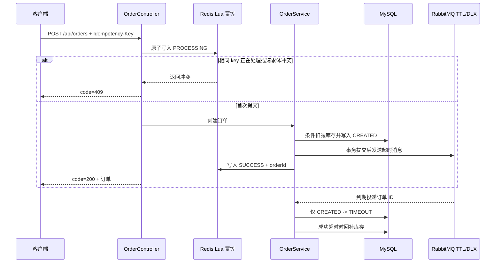
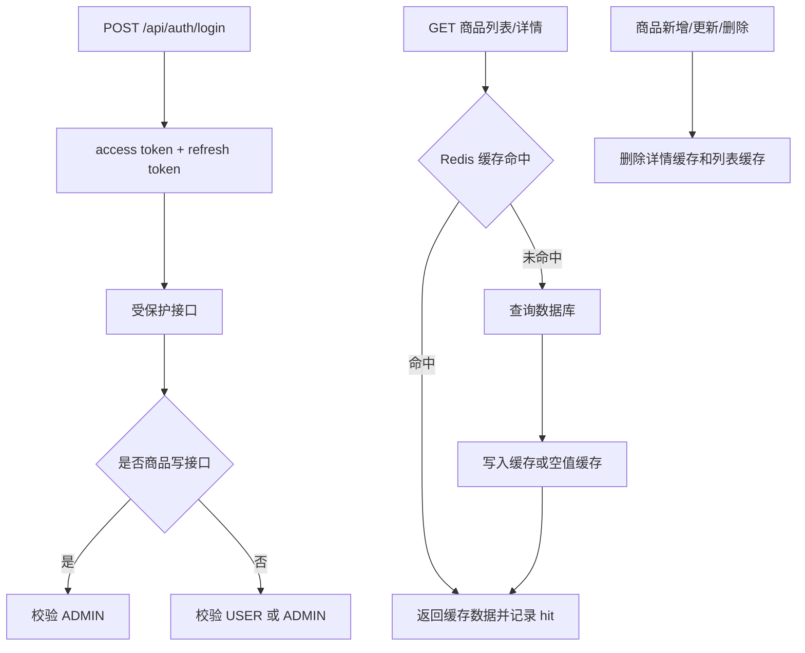

# 电商购物平台核心流程图

**最后更新**：2026-06-15

## 下单幂等与超时关闭

```mermaid
sequenceDiagram
    participant Client as 客户端
    participant API as OrderController
    participant Idem as Redis Lua 幂等
    participant Service as OrderService
    participant DB as MySQL
    participant MQ as RabbitMQ TTL/DLX

    Client->>API: POST /api/orders + Idempotency-Key
    API->>Idem: 原子写入 PROCESSING
    alt 相同 key 正在处理或请求体冲突
        Idem-->>API: 返回冲突
        API-->>Client: code=409
    else 首次提交
        API->>Service: 创建订单
        Service->>DB: 条件扣减库存并写入 CREATED
        Service->>MQ: 事务提交后发送超时消息
        Service->>Idem: 写入 SUCCESS + orderId
        API-->>Client: code=200 + 订单
    end
    MQ-->>Service: 到期投递订单 ID
    Service->>DB: 仅 CREATED -> TIMEOUT
    Service->>DB: 成功超时时回补库存
```

## 认证与商品缓存

```mermaid
flowchart TD
    Login["POST /api/auth/login"] --> Token["access token + refresh token"]
    Token --> Protected["受保护接口"]
    Protected --> Role{"是否商品写接口"}
    Role -->|是| Admin["校验 ADMIN"]
    Role -->|否| User["校验 USER 或 ADMIN"]

    ProductRead["GET 商品列表/详情"] --> Cache{"Redis 缓存命中"}
    Cache -->|命中| Response["返回缓存数据并记录 hit"]
    Cache -->|未命中| Database["查询数据库"]
    Database --> Fill["写入缓存或空值缓存"]
    Fill --> Response
    ProductWrite["商品新增/更新/删除"] --> Evict["删除详情缓存和列表缓存"]
```
